Introduction to Time Series Analysis
========================================================

### Workflow Overview of Univariate Time Series Analysis
1. detect trend
2. detect seasonality
3. detect outliers
4. detect long-run cycle
5. assume constant variances
6. detect abrupt changes in either level or variances

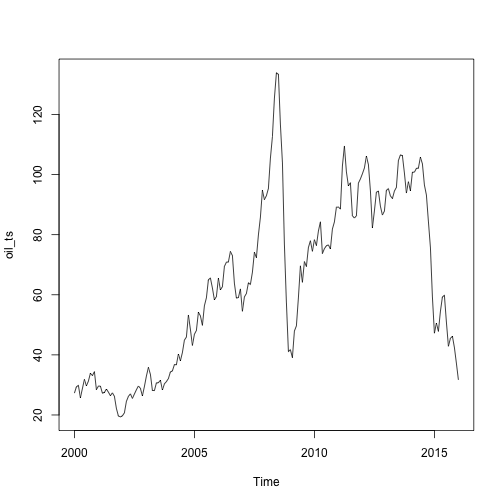 

Features of the plot:

1. there is an increasing trend before 2008 / 2009 and another increasing trend before end of 2014

2. hard to tell about seasonality

3. no obvious outlier

4. volatility/variances seem not to be constant - smaller before 2005; bigger after 2008 / 2009

### Types of Stationary Univariate Time Series Models: forecast univariate time series future values

1. AR(1) or AR(p):
$X_t = \delta + \phi_1X_{t-1} + \epsilon_t$
Assumptions:

(1) $\epsilon_t$ is i.i.d. $N(0, \sigma_{\epsilon}^2)$: i.i.d. constant variances

(2) $\epsilon_t$ is independent of $X$'s

(3) $X$'s is random, not within control

to determine if it is a AR(1) process, you can plot $X_t$ versus $X_{t-1}$

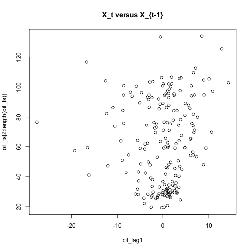 

there does not seem to be a clear pattern between $X_t$ and $X_{t-1}$, when we try to fit OLS model between the 2:


```
## 
## Call:
## lm(formula = oil_ts[2:length(oil_ts)] ~ oil_lag1)
## 
## Residuals:
##     Min      1Q  Median      3Q     Max 
## -44.204 -29.220  -1.266  26.183  69.900 
## 
## Coefficients:
##             Estimate Std. Error t value Pr(>|t|)    
## (Intercept)  63.7125     2.0525  31.042   <2e-16 ***
## oil_lag1      0.4757     0.3600   1.322    0.188    
## ---
## Signif. codes:  0 '***' 0.001 '**' 0.01 '*' 0.05 '.' 0.1 ' ' 1
## 
## Residual standard error: 28.44 on 190 degrees of freedom
## Multiple R-squared:  0.009108,	Adjusted R-squared:  0.003893 
## F-statistic: 1.746 on 1 and 190 DF,  p-value: 0.1879
```

it confirms our assumption: p-value is not significant for the slope and $R^2$ is really low

we also do residual plot versus fitted to check for $X_t$ and $\epsilon_t$ are independent

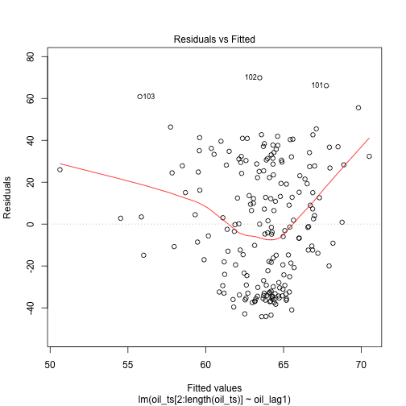 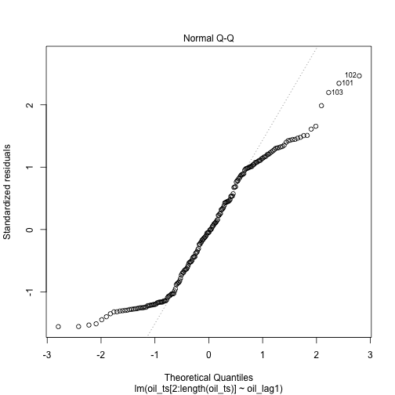 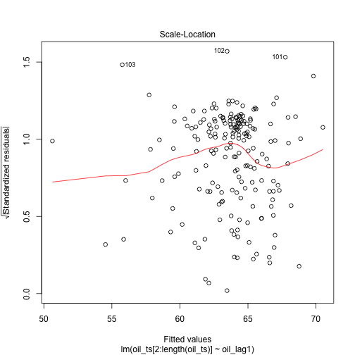 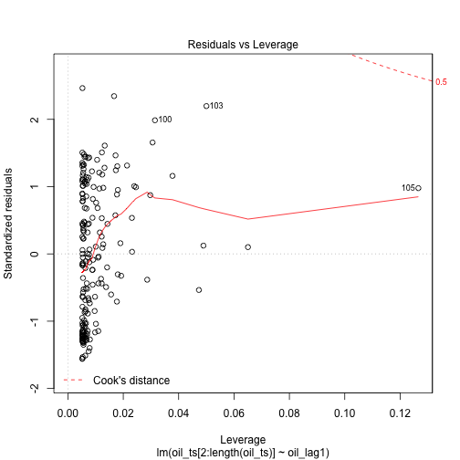 

we see that it is not completely independent and there are outliers

2. Model 2: ARIMA(p, d, q) accounts for trend as well as seasonality

Trend analysis:

* for linear trend: use t as a predictor in regression

* for quadratic trend: use $t$ and $t^2$

* for seasonality: use indicator $S_j$ = 1 for observation in month/quarter j of the year

Correlation Analysis:

* $X_t$ can be related to past values: use ACF to find out correlation between lagged values

* ACF plot on residuals: should not be significant indication of correlation after model fitting

* ACF for $X_t$ and $X_{t-h}$ is the same for all $t$ in stationary series and should be symmetrical around h=0:
  
    * ACF for AR(1) exponentially decreases to 0 for positive coefficient; and alternatively exponentially decreases to 0 for negative coefficient
    
    * ACF for MA(1) = 0 for h > 1; only a spike at h=1
    
    * ACF for MA(2): 2 significant spikes at h = 1 and 2

* PACF is the conditional correlation: helps a lot in identifying AR model: (while ACF is good for identifying MA model)

* PACF shuts off (=0) beyond p for AR(p)
    
### Decomposition of a model: 

$X_t = Trend + Seasonal + Random$ for constant seasonal variation

$X_t = Trend*Seasonal*Random$ for seaonal variation increases over time

Steps in Decomposition:

1. estimate trend and de-trend:

moving average

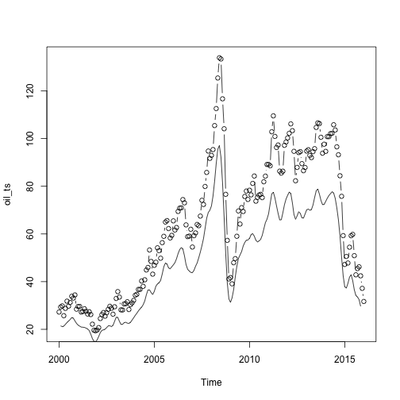 

2. seasonality adjustment so they average to 0

Example: additive decomposition:
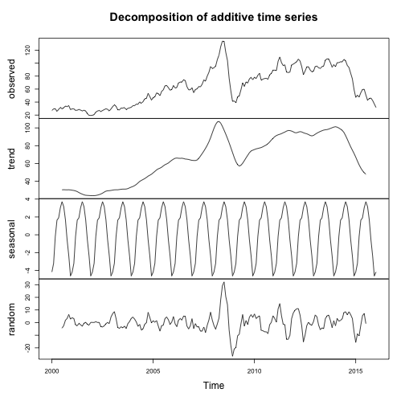 

Example: multiplicative decomposition:
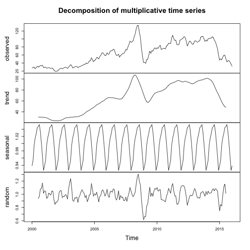 
### Vector Autoregressive models VAR(p)

Each variable is a linear function of past lags of itself and past lags of the other variables

Examples of VAR(1):

* $X_{t,1} = \alpha_1 + \phi_{11}X_{t-1,1} + \phi_{12}X_{t-1,2} + \phi_{13}X_{t-1,3} + \omega_{t,1}$

same thing for $X_{t,2}$, $X_{t,3}$

In general, for VAR(p) model, the first p lag of each variable in the system would be used as regression predictors for each variable.

* Difference-Stationary Model:


```r
library(vars)
```

```
## Loading required package: MASS
## Loading required package: strucchange
## Loading required package: zoo
## 
## Attaching package: 'zoo'
## 
## The following objects are masked from 'package:base':
## 
##     as.Date, as.Date.numeric
## 
## Loading required package: sandwich
## Loading required package: urca
## Loading required package: lmtest
```

```r
library(astsa)
```

```
## 
## Attaching package: 'astsa'
## 
## The following object is masked _by_ '.GlobalEnv':
## 
##     oil
```

```r
head(cmort)
```

```
## [1]  97.85 104.64  94.36  98.05  95.85  95.98
```

```r
head(tempr)
```

```
## [1] 72.38 67.19 62.94 72.49 74.25 67.88
```

```r
head(part)
```

```
## [1] 72.72 49.60 55.68 55.16 66.02 44.01
```

```r
plot.ts(cbind(cmort, tempr, part))
```

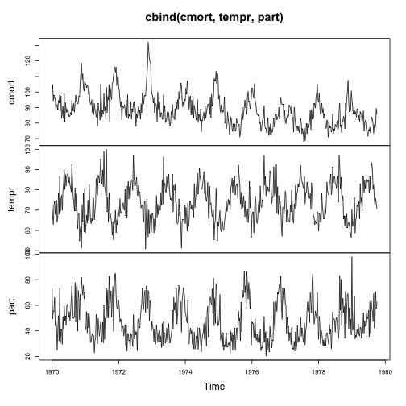 

```r
summary(var(cbind(cmort, tempr, part), p=1, type="both"))
```

```
## Error in summary(var(cbind(cmort, tempr, part), p = 1, type = "both")): error in evaluating the argument 'object' in selecting a method for function 'summary': Error in var(cbind(cmort, tempr, part), p = 1, type = "both") : 
##   unused arguments (p = 1, type = "both")
```

the above fits model $C_t = \mu + \phi_1t + \phi_2T_t + \phi_3P_t$ and so on

To take a look on the 1st, 2nd, 3rd variables:

```
## Error in var(cbind(cmort, tempr, part), p = 1, type = "both"): unused arguments (p = 1, type = "both")
```

```
## Error in var(cbind(cmort, tempr, part), p = 1, type = "both"): unused arguments (p = 1, type = "both")
```

```
## Error in var(cbind(cmort, tempr, part), p = 1, type = "both"): unused arguments (p = 1, type = "both")
```

### Test for Correlated Errors

Durbin-Watson test

### Regression model to contain autocorrelated errors

$$y_t = \beta_0 + \beta_1x_{1,t} + ... + \beta_kx_{k,t} + n_t$$

$n_t$ follows ARIMA(p,d,q) model

Assumptions: $y_t$ and all $X_t$ are stationary

Steps:

1. difference the non-stationary variables to make them stationary
differenced models with ARMA errors are equivalent to original model with ARIMA errors

2. Start a proxy model with ARIMA(2,0,0)(1,0,0)m errors for seasonal data
estimate coefficients, calculate preliminary values for ARIMA errors and then select a more approriate ARMA model for errors and refit

3. Check for white noise assumption

4. Calculate AIC for the final model to determine the best predictors


```
##         When          AgeGroup        Sex Alberta BritishColumbia Canada
## 1 01/01/1976 15 years and over    Females     5.2             9.7    8.1
## 2 01/01/1976    15 to 24 years      Males     8.0            15.3   13.2
## 3 01/01/1976 15 years and over      Males     3.8             7.8    6.4
## 4 01/01/1976    15 to 24 years    Females     8.3            12.9   11.2
## 5 01/01/1976    15 to 24 years Both sexes     8.1            14.2   12.3
## 6 01/01/1976 15 years and over Both sexes     4.3             8.5    7.1
##   Manitoba NewBrunswick NewfoundlandAndLabrador NovaScotia Ontario
## 1      5.2         11.4                    11.5        8.3     8.1
## 2     11.9         17.2                    19.2       14.5    11.6
## 3      5.8         11.1                    12.6        7.6     5.2
## 4      9.6         15.1                    16.5       14.0    10.1
## 5     10.8         16.3                    18.1       14.3    10.9
## 6      5.6         11.2                    12.3        7.9     6.4
##   PrinceEdwardIsland Quebec Saskatchewan
## 1               10.8    8.9          4.3
## 2               21.4   15.9          7.9
## 3                9.3    7.7          3.5
## 4               14.9   12.6          6.9
## 5               18.2   14.4          7.6
## 6                9.9    8.1          3.8
```

```
##         Jan    Feb    Mar    Apr    May    Jun    Jul    Aug    Sep    Oct
## 2000  27.26  29.37  29.84  25.72  28.79  31.82  29.70  31.26  33.88  33.11
## 2001  29.59  29.61  27.24  27.49  28.63  27.60  26.42  27.37  26.20  22.17
## 2002  19.71  20.72  24.53  26.18  27.04  25.52  26.97  28.39  29.66  28.84
## 2003  32.95  35.83  33.51  28.17  28.11  30.66  30.75  31.57  28.31  30.34
## 2004  34.31  34.68  36.74  36.75  40.28  38.03  40.78  44.90  45.94  53.28
## 2005  46.84  48.15  54.19  52.98  49.83  56.35  59.00  64.99  65.59  62.26
## 2006  65.49  61.63  62.69  69.44  70.84  70.95  74.41  73.04  63.80  58.89
## 2007  54.51  59.28  60.44  63.98  63.45  67.49  74.12  72.36  79.91  85.80
## 2008  92.97  95.39 105.45 112.58 125.40 133.88 133.37 116.67 104.11  76.61
## 2009  41.71  39.09  47.94  49.65  59.03  69.64  64.15  71.04  69.41  75.72
## 2010  78.33  76.39  81.20  84.29  73.74  75.34  76.32  76.60  75.24  81.89
## 2011  89.17  88.58 102.86 109.53 100.90  96.26  97.30  86.33  85.52  86.32
## 2012 100.27 102.20 106.16 103.32  94.65  82.30  87.90  94.13  94.51  89.49
## 2013  94.76  95.31  92.94  92.02  94.51  95.77 104.67 106.57 106.29 100.54
## 2014  94.62 100.82 100.80 102.07 102.18 105.79 103.59  96.54  93.21  84.40
## 2015  47.22  50.58  47.82  54.45  59.27  59.82  50.90  42.87  45.48  46.22
## 2016  31.68                                                               
##         Nov    Dec
## 2000  34.42  28.44
## 2001  19.64  19.39
## 2002  26.35  29.46
## 2003  31.11  32.13
## 2004  48.47  43.15
## 2005  58.32  59.41
## 2006  59.08  61.96
## 2007  94.77  91.69
## 2008  57.31  41.12
## 2009  77.99  74.47
## 2010  84.25  89.15
## 2011  97.16  98.56
## 2012  86.53  87.86
## 2013  93.86  97.63
## 2014  75.79  59.29
## 2015  42.44  37.19
## 2016
```

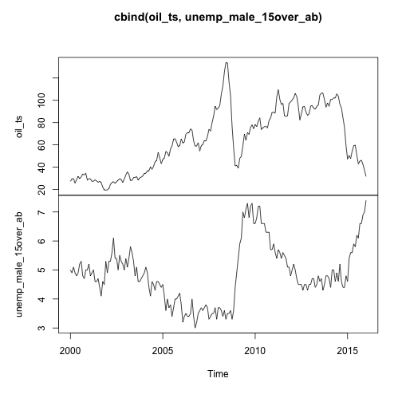 

```
## [1] "Oil price is non-stationary"
```

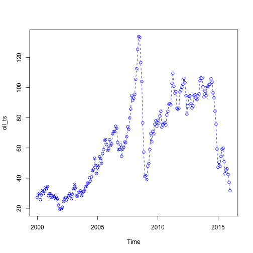 

```
## [1] "Do a 1st degree differencing for oil price:"
```

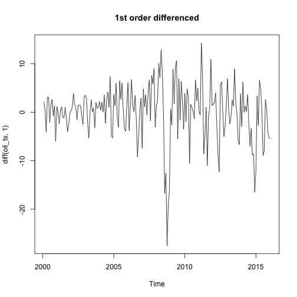 

```
## [1] "check for ACF for 1st degree differencing"
```

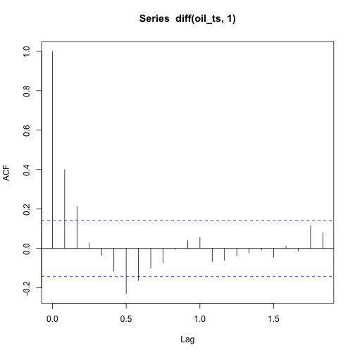 

```
## [1] "we are assuming AR(1) model for diff(oil_ts)"
```

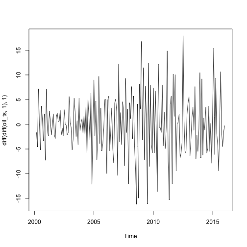 

```
## [1] "it looks like the non-stationary trend is solved, but the non-stationary variances remain, to solve that, log transformation cannot be applied here because of NA produced"
```

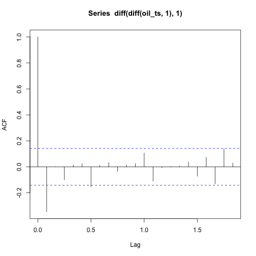 

```
## [1] "kpss unit root test for stationarity"
```

```
## Error in contrib.url(repos, "source"): trying to use CRAN without setting a mirror
```

```
## Warning in kpss.test(diff(diff(oil_ts, 1), 1)): p-value greater than
## printed p-value
```

```
## 
## 	KPSS Test for Level Stationarity
## 
## data:  diff(diff(oil_ts, 1), 1)
## KPSS Level = 0.0117, Truncation lag parameter = 3, p-value = 0.1
```

```
## [1] "p>0.1 infers no significant evidence to reject stationary null hypothesis"
```

```
## [1] "Transform Unemployment rate to stationary"
```

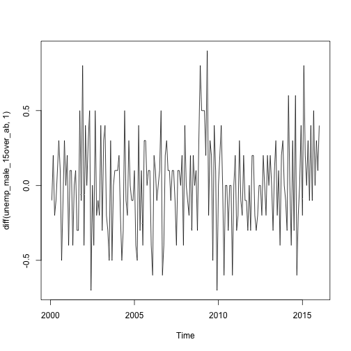 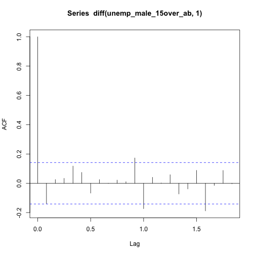 

```
## Warning in kpss.test(diff(unemp_male_15over_ab, 1)): p-value greater than
## printed p-value
```

```
## 
## 	KPSS Test for Level Stationarity
## 
## data:  diff(unemp_male_15over_ab, 1)
## KPSS Level = 0.1949, Truncation lag parameter = 3, p-value = 0.1
```

```
## [1] "p>0.1 infers no significant evidence to reject stationary null hypothesis"
```

```
## [1] "we build a model with ARIMA errors"
```

```
## [1] "we shift oil price 2 times and unemp 1 time, hence the length of the time series is different"
```

```
## Error in eval(expr, envir, enclos): could not find function "Arima"
```

```
## Error in eval(expr, envir, enclos): could not find function "tsdisplay"
```

```
## Error in eval(expr, envir, enclos): object 'fit' not found
```
